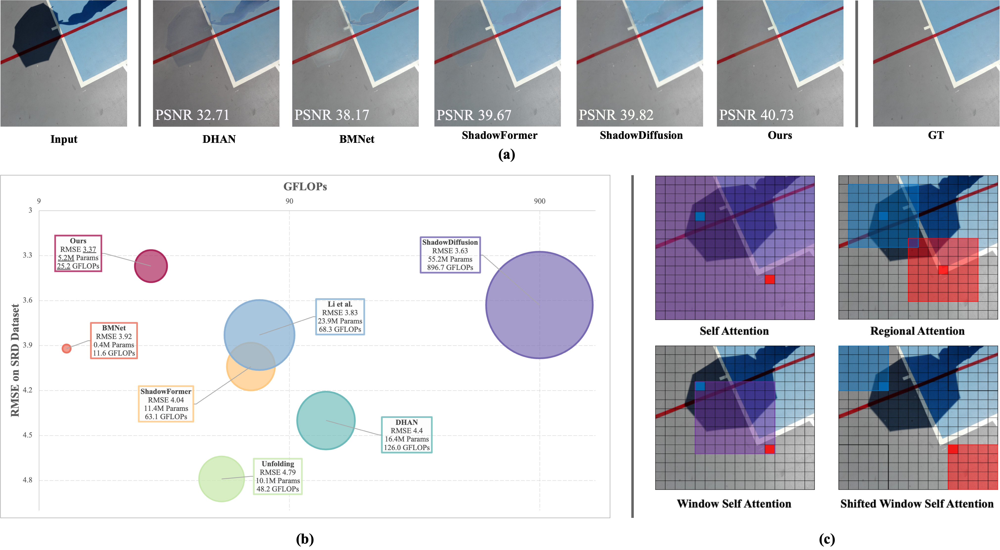
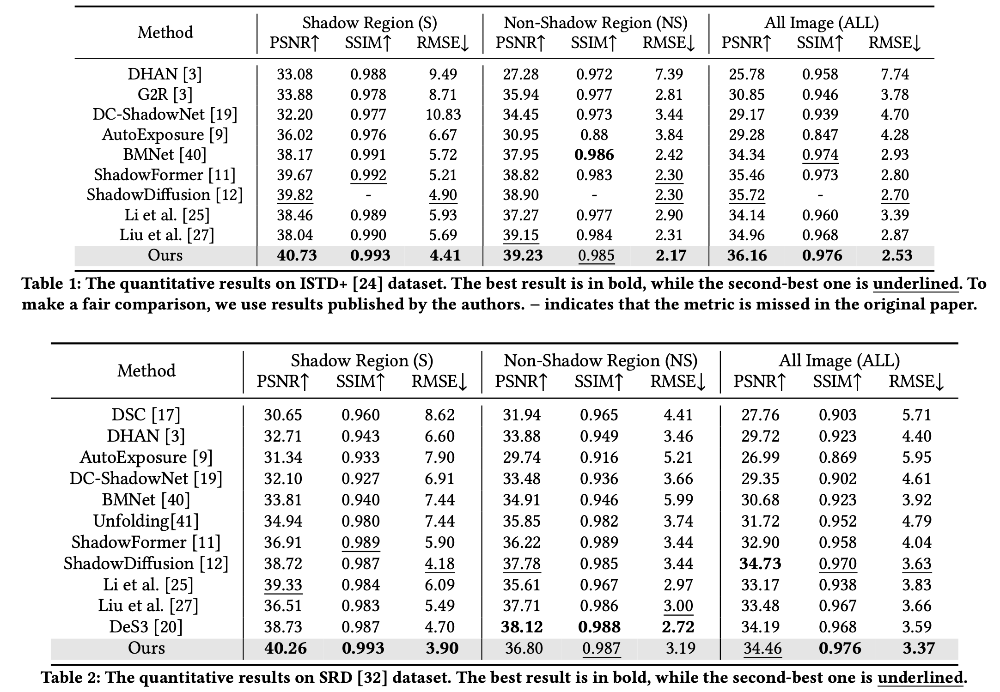
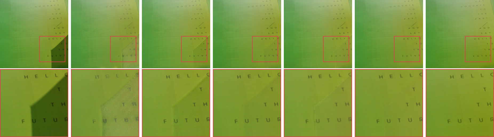
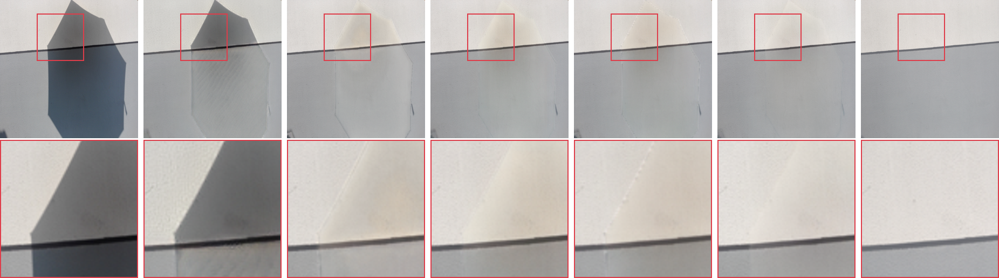
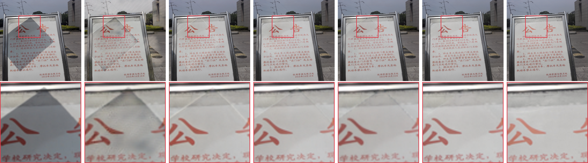
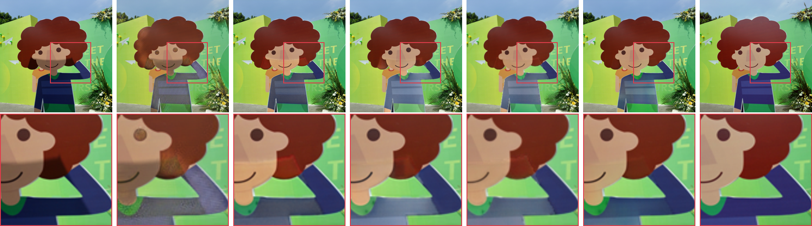
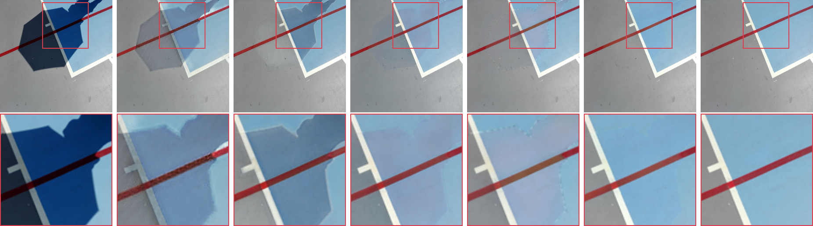
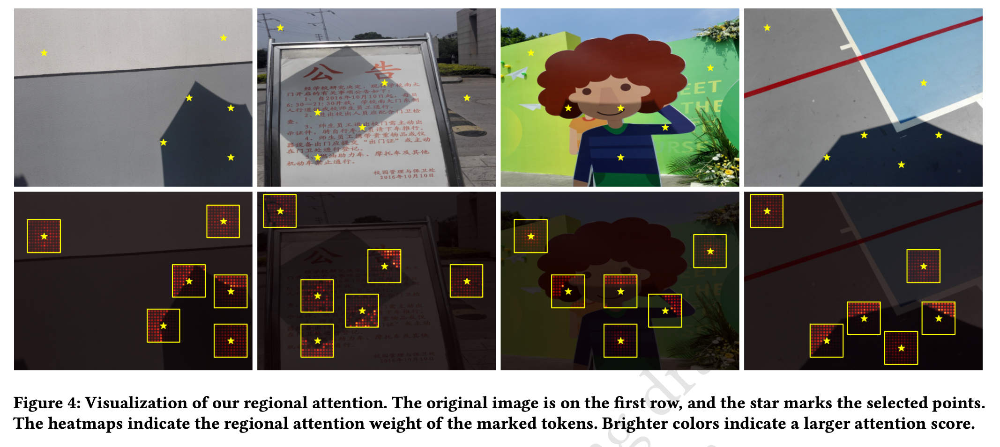

# RASM (ACM MM'24)
This is the official implementation of the ACM MM 2024 paper Regional Attention For Shadow Removal.

<!-- You can also view our paper via the [link](https://drive.google.com/file/d/1mc8lFa3lPIgvBLldF1fsnpUxTtkDZXH0/view?usp=sharing). -->

## Introduction
Shadow, as a natural consequence of light interacting with objects, plays a crucial role in shaping the aesthetics of an image, which however also impairs the content visibility and overall visual quality. Recent shadow removal approaches employ the mechanism of attention, due to its effectiveness, as a key component. However, they often suffer from two issues including large model size and high computational complexity for practical use. To address these shortcomings, this work devises a lightweight yet accurate shadow removal framework. First, we analyze the characteristics of the shadow removal task to seek the key information required for reconstructing shadow regions and designing a novel regional attention mechanism to effectively capture such information. Then, we customize a Regional Attention Shadow Removal Model (RASM, in short), which leverages non-shadow areas to assist in restoring shadow ones. Unlike existing attention-based models, our regional attention strategy allows each shadow region to interact more rationally with its surrounding non-shadow areas, for seeking the regional contextual correlation between shadow and non-shadow areas. Extensive experiments are conducted to demonstrate that our proposed method delivers superior performance over other state-of-the-art models in terms of accuracy and efficiency, making it appealing for practical applications.

<!-- For more details, please refer to our [original paper](https://dl.acm.org/doi/10.1145/3664647.3681126) -->

<p align=center></p>

## Requirement
* Pytorch 2.1.2
* CUDA 11.8
```bash
sh setup.sh
```

## Datasets 
* ISTD+ [[link]](https://github.com/cvlab-stonybrook/SID)
* SRD 

## Checkpoints
[ISTD+](https://drive.google.com/file/d/12LlajwdxoRR0dLXAJmfgYZzkyo2wtyix/view?usp=sharing) | [SRD](https://drive.google.com/file/d/1DLZRstZGzyryRvPFjCmIdAB_oo_tMzpP/view?usp=sharing)


## Test
You can directly test the performance of the model as follows
```bash
python test.py --input_dir path/to/data \
--weights path/to/checkpoint \
--result_dir ./results \
--ex_name name \
--save_images \
--cal_metrics 
```
You can check the output in `./results`.


## Evaluation
The results reported in the paper are calculated by the `matlab` script used in [previous method](https://github.com/zhuyr97/AAAI2022_Unfolding_Network_Shadow_Removal/tree/master/codes). Details refer to `evaluation/measure_shadow.m`.

## Results

#### Evaluation
<p align=center></p>


#### Visual Results
<p align=center></p>
<p align=center></p>
<p align=center></p>
<p align=center></p>
<p align=center></p>
<p align=center>From left to right are: Input, DC-ShadowNet, BMNet, ShadowFormer, ShadowDiffusion, Ours, and GT.</p>

<p align=center></p>


#### Testing results
The testing results on dataset ISTD+, SRD are: [results](https://drive.google.com/drive/folders/1BTk9FvuWyF7QUhto5MaejxgPrLmgDqGP?usp=sharing)

## References
Our implementation is based on [ShadowFormer](https://github.com/GuoLanqing/ShadowFormer/tree/main) and [Neighborhood-Attention-Transformer](https://github.com/SHI-Labs/Neighborhood-Attention-Transformer). We would like to thank them.

Citation
-----
In case of use, please cite our publication:

Bibtex:
```
@inproceedings{10.1145/3664647.3681126,
  author = {Liu, Hengxing and Li, Mingjia and Guo, Xiaojie},
  title = {Regional Attention For Shadow Removal},
  year = {2024},
  isbn = {9798400706868},
  publisher = {Association for Computing Machinery},
  address = {New York, NY, USA},
  url = {https://doi.org/10.1145/3664647.3681126},
  doi = {10.1145/3664647.3681126},
  booktitle = {Proceedings of the 32nd ACM International Conference on Multimedia},
  pages = {5949–5957},
  numpages = {9},
  keywords = {regional attention, shadow removal},
  location = {Melbourne VIC, Australia},
  series = {MM '24}
}
```

## Contact
If you have any questions, please contact chrisliu.jz@gmail.com
